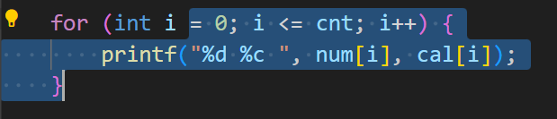
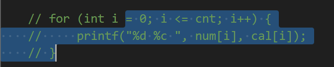

# 猪脚说第二期

## 继续debug

在上周的猪脚说里，向大家详细地介绍了如何给自己的程序debug，不知大家对`printf`和**断点**的理解得怎么样了。在本周的线上答疑过程中，发现有些同学已经初步掌握了调试程序的方法，但是对一些问题的理解还不是很透彻，这里再列举一些常见的问题和大家一起探讨下：

### 何时调试

我想和大家探讨的第一个问题是：我们应该在什么时候对我们的程序进行测试？我发现大部分同学的做法是一口气把一道题写完。接下来大家是不是会直接点运行，大概率发现编译都过不了，改了一会好不容器编译能过了，结果发现结果和答案差得十万八千里，甚至程序在中间就莫名其妙地终止了，或者卡住死循环根本结束不了程序运行。

我相信这是大部分人真实的情况，或者说大部分人应该都经历过这个阶段。如果大家看了**上一期猪脚说**，那么接下来应该如何调试，想必很清楚了——在每一个程序层结束后输出结果量，定位到错点。

然而，大家往往会发现：假如本题可以在逻辑上分成三步，发现了第一步的bug并改好后，发现第二步又出了问题，修复后第三步又出了问题——甚至有可能因为前两步的重大错误，导致第三步已经写好的代码根本无法完成目的，只能重写。

我更推荐大家在写程序的过程中就一并进行测试：比如我将本题分成三步，我会在第一步的读入操作代码写完后直接把读入的结果打印出来，如果有问题，直接把这部分代码改成正确的，然后**把这部分打印部分的代码注释掉**，接着去写第二步。。。如此一直进行下去。

这样做的好处显而易见：我们在完成下一阶段的代码时，可以确保前面几步的逻辑是完全没有问题的，这样写出来的代码往往是**不需要再进行debug的了**，也就是一遍直接AC。

### 注释快捷键

如果现在我写了三行调试的代码，想一起注释掉，应该有不少同学只能逐行在前面加`//`，或者直接给删掉，下次要是再想用就重写吧。其实很多IDE都有这种多行注释的快捷键，比如`Vscode`，当我选中了图中几行后（光标的位置无所谓）：



再点击`Ctrl`+`/`，就可以直接把这几行一起注释掉：



想取消注释的话，再进行一遍相同的操作即可。大部分的IDE的快捷键应该都是`Ctrl`+`/`，大家可以自行去查看一下自己的IDE的快捷键。

### 自己构造样例测试（重要）

很多同学给我发来代码debug的时候都会这么描述：题面中给的样例过了，但是就是有几个点过不去，那几个点中我的输出和目标输出相比差了什么什么东西，实在想不出来有什么bug了，助教能帮我看看吗？

相信大家都很清楚，题面中给的样例一般都是很弱的，而真实的测评一定会评测所有极限情况，所以不可完全信任样例数据。

自己构造数据进行测试是一项非常基本的能力（就像我们写代码，调试代码的能力一样）。这周来找我这么问过问题的同学应该记得，我一般是不会直接告诉大家程序的问题在哪，而是我自己构造了一组输入，然后把中间结果量打印出来，就发现了程序中的某些问题——大家看了我自己调的样例后，应该很快就发现了问题所在。

比如第二次作业的第三题，加密字符串大家完全可以自己去构造，比如输入一个`xyzzxyxzazx`，看看加密后的密码表是否出错了，然后再找bug就很容易了。

这种能力十分重要，如果大家进入专业学院后还要求写代码的话，不会有助教一行一行地读大家的代码帮着找bug了，而程序本身又很复杂，自己手动构造样例几乎很难包含所有情况，这时需要大家自己搭评测机去自动化测试。——而这一切经验其实都来源于大家目前阶段自己构造数据debug的过程，所以请大家重视起来这一点。

## 本周问题汇总

### 程序中char型字符的问题

上周的猪脚说里已经和大家探讨了char类型在计算机中究竟是怎么回事，大家也知道了程序中的`'a'`就可以代表字符`a`，请大家千万不要再写出`97`,`122`这种神仙数了！因为我们写的代码是给我们自己以及合作开发的**人**读的，而不是给计算机读的——大家写出来的代码经过编译链接最后得到的可执行文件就是01序列，请务必保证自己代码的可读性。

## 知识点补充

### C语言常用字符串常用库函数<string.h>

下面是一些常用的库函数，在涉及**字符串处理**的时候灵活运用这些字符串库函数有时候能起到事半功倍的效果。希望大家能够多多使用，灵活记忆。

建议大家也可以**自己实现一下库函数**，然后和原生库函数对比一下实现的正确性以及效率等等。提高自己对字符串处理的理解与熟练程度。

#### strlen

计算字符串长度

```c
size_t strlen(const char *str)
```

计算字符串 str 的长度，直到空结束字符，但不包括空结束字符（即"\\0"）。

#### strcpy

字符串复制

```c
char *strcpy(char *dest, const char *src)
```

把 src 所指向的字符串复制到 dest。

#### strncpy

复制连续的n个字符

```c
char *strncpy(char *dest, const char *src, size_t n)
```

把 src 所指向的字符串复制到 dest，最多复制 n 个字符。

#### strcat

把一个字符串连接到另一个字符串后面

```c
char *strcat(char *dest, const char *src)
```

把 src 所指向的字符串追加到 dest 所指向的字符串的结尾。

#### strncat

把连续的n个字符连接到另一个字符串后面

```c
char *strncat(char *dest, const char *src, size_t n)
```

把 src 所指向的字符串追加到 dest 所指向的字符串的结尾，直到 n 字符长度为止。

示例：

```c
#include <stdio.h>
#include <string.h>

int main(void)
{
    char str0[20] = "Test:";
    char str1[20] = "Welcome9999";
    char str2[20] = " To ";
    char str3[20] = "0123Beijing55";
    char tmp[100];

    strcpy(tmp, str0);
    puts(tmp);      //Test:

    strncpy(tmp, str1, 7);  //取st1前7个字符
    puts(tmp);      //Welcome

    strcat(tmp, str2);      //连接str2
    puts(tmp);

    strncat(tmp, str3 + 4, 7);  //取str3+4之后的7个字符
    puts(tmp);

    return 0;
}
```

#### strchr

查找某字符在字符串中首次出现的位置指针，如果不存在则返回NULL

```c
char *strchr(const char *str, int c)
```

在参数 str 所指向的字符串中搜索第一次出现字符 c（一个无符号字符）的位置。

示例：

```c
#include <string.h>
#include <stdio.h>
int main(void)
{
    char string[20] = "This is a string";
    char *ptr1, *ptr2;
    char c1 = 'r', c2 = 'b';

    ptr1 = strchr(string, c1);
    ptr2 = strchr(string, c2);

    if(ptr1)
        printf("字符1:%c 的位置是: %s \n",c1,ptr1);
    else
        printf("字符1:%c 未找到 \n", c1);

    if(ptr2)
        printf("字符2:%c 的位置是: %s \n",c2,ptr2);
    else
        printf("字符2:%c 未找到 \n", c2);

    return 0;
}
```

#### strcmp

字符串比较

```c
int strcmp(const char *str1, const char *str2)
```

把 str1 所指向的字符串和 str2 所指向的字符串进行比较。

设这两个字符串为str1，str2， 若str1=str2，则返回零； 若str1str2，则返回正数。

示例：

```c
#include <string.h>
#include <stdio.h>
int main(void)
{
    char str1[20] = "abc";
    char str2[20] = "abc";
    char str3[20] = "bbc";

    int r1, r2, r3;

    r1 = strcmp(str1, str2);
    r2 = strcmp(str1, str3);
    r3 = strcmp(str3, str1);

    printf("r1 = %d, r2 = %d, r3 = %d \n", r1, r2, r3);

    return 0;
}
```

#### strstr

字符串查找

```c
char *strstr(const char *haystack, const char *needle)
```

在字符串 haystack 中查找第一次出现字符串 needle（不包含空结束字符）的位置。

#### strncmp

```text
int strncmp(const char *str1, const char *str2, size_t n)
```

把 str1 和 str2 进行比较，最多比较前 n 个字节。

#### memcpy

内存复制

```text
void *memcpy(void *dest, const void *src, size_t n)
```

从 src 复制 n 个字符到 dest。

### \r与\n

大家在文件处理的时候可能遇到某些情况，比如输出到文件的结果多了很多奇怪的换行符，但是直接提交到平台上又显示没有问题。不用担心，这实际上是windows系统和linux系统的换行符的差别。

\n这个字符大家很熟悉，是**换行符**，英文是**New Line**。而\r这个字符大家可能就没见过了，实际上这个字符代表着**回车**，英文是**Carriage return**。大家可能会疑惑，换行咱不也是按回车键吗？？这就涉及到系统对于换行符号的定义问题了。简单来说，不同的系统敲回车键代表的意义不同。\r的意义实际上是将输出的光标移动至首部，\n则是将光标移动至下一行。而各个系统在换行时输入字符是不太一样的，具体可以看下面这张图：


又回到刚刚的问题了，我们一般调试程序使用的是windows系统，那有的同学就说了，我怎么没有这种问题。这实际上就是C语言在处理文件输入**两种格式**的问题。我们知道，读入文件有两种格式，一种是"r"，一种是"rb"，都表示文件只读，但是后者是读取二进制文件。在后者这个模式下，文本文件的换行符会以原本的形式读入字符串中，即：在windows系统下，读入的换行符是\r\n，而linux系统则直接读入\n，在输出的时候，如果输出模式是"w"而不是"wb"，windows系统西，C语言会将\r在文本文件中也输出成换行的形式，因此出现了很多奇怪的换行。但是在linux系统就没有这种问题。因此，如果大家用"rb"模式读取文件，判断换行时在本地调试的时候需要注意\r的存在，但是在平台linux系统上就只有\n了。而在"r"模式下，读入的换行符会被自动解析为\n，所以有的同学就不会出现这个问题。

又有的人要问了，那既然这样我以后都用"r"模式读入文件不就好了，那当然没问题。但是如果使用fread函数读取文件时就要小心了，会出现奇怪的bug哦。因为fread是字节流的形式读取文件内容，如果不使用"rb"模式，当读取长度大于文件长度时，末尾很可能出现奇怪的东西，大家可以自行尝试，加深理解。

### 结构体

关于结构体的内容，大家可以先自行学习，由于内容稍多，这里不加赘述，大家可以点击[这里](https://www.runoob.com/cprogramming/c-structures.html)进行学习。

### qsort排序

#### qsort函数原型

```text
void qsort(
    void *base,
    size_t nmemb,
    size_t size,
    int (*cmp)(const void *, const void *)
    );
```

**头文件**:<stdlib.h> **函数功能**：qsort()函数的功能是对数组进行排序，数组有nmemb个元素，每个元素大小为size。

**参数base** - base指向数组的起始地址，通常该位置传入的是一个数组名 **参数nmemb** - nmemb表示该数组的元素个数 **参数size** - size表示该数组中每个元素的大小（字节数） **参数`(*cmp)(const void *, const void *)`** - 此为指向比较函数的函数指针，决定了排序的顺序。 **函数返回值**：无 **注意**：如果两个元素的值是相同的，那么它们的前后顺序是不确定的。也就是说qsort()是一个不稳定的排序算法。

#### cmp参数

cmp参数是qsort函数排序的核心内容，它指向一个比较两个元素的函数，注意两个形参必须是const `void *`型，同时在调用cmp 函数（cmp实质为函数指针，这里称它所指向的函数也为cmp）时，传入的实参也必须转换成`const void *`型。在cmp函数内部会将`const void *`型转换成实际类型，见下文。

```c
int cmp(const void *p1, const void *p2);
```

如果cmp返回值小于0（< 0），那么p1所指向元素会被排在p2所指向元素的前面 如果cmp返回值等于0（= 0），那么p1所指向元素与p2所指向元素的顺序不确定 如果cmp返回值大于0（> 0），那么p1所指向元素会被排在p2所指向元素的后面 因此，如果想让qsort()进行从小到大（升序）排序，那么一个通用的cmp函数可以写成这样：

```c
 int cmp (const void * a, const void * b)
 {
   if ( *(MyType*)a <  *(MyType*)b ) return -1;
   if ( *(MyType*)a == *(MyType*)b ) return 0;
   if ( *(MyType*)a >  *(MyType*)b ) return 1;
 }
```

注意：你要将MyType换成实际数组元素的类型。 或者

```c
//升序排序
 int cmp (const void * a, const void * b)
 {
     return ( *(int*)a - *(int*)b );
 }
//降序排列
 int cmp (const void * a, const void * b)
 {
     return ( *(int*)b - *(int*)a );
 }
```

#### int 数组排序

```c
/* qsort example */
#include <stdio.h>     
#include <stdlib.h>     

int values[] = { 40, 10, 100, 90, 20, 25 };

int cmp (const void * a, const void * b)
{
  return ( *(int*)a - *(int*)b );
}

int main ()
{
  int n;
  qsort (values, sizeof(values)/sizeof(values[0]), sizeof(int), cmp);
  for (n=0; n<sizeof(values)/sizeof(values[0]); n++)
     printf ("%d ",values[n]);
  return 0;
}
```

#### 结构体排序

```c
#define _CRT_SECURE_NO_WARNINGS
#include <stdio.h>
#include<stdlib.h>
// void qsort(void* base, size_t num, size_t size, int(*cmp)(const void*, const void*))

typedef struct
{
    char name[30];   // 学生姓名
    int Chinese;    // 语文成绩
    int Math;        // 数学成绩  
    int English;     // 英语成绩
}st; 
int cmp(const void* a, const void* b)
{
    st* pa = (st*)a;
    st* pb = (st*)b;
    int num1 = pa->Chinese + pa->English + pa->Math;
    int num2 = pb->Chinese + pb->English + pb->Math;

    //return (int)num1 - num2;   // 从小到大，
    return (int)num2 - num1;   //  从大到小
}
int main(void)
{
    st students[7] = {
        {"周",97,68,45},
        {"吴",100,32,88},
        {"郑",78,88,78},
        {"王",87,90,89},
        {"赵",87,77,66},
        {"钱",59,68,98},
        {"孙",62,73,89}
    };
    qsort(students, 7, sizeof(st), cmp);   // 注意区别 students 与 st

    for (int i = 0; i < 7; i++)
    {
        printf("%s%4d%4d%4d\t", students[i].name, students[i].Chinese, students[i].Math, students[i].English);
        printf("总分：%d\n", students[i].Chinese + students[i].English + students[i].Math);
    }

    system("pause");
    return 0;
}
```

#### 字符串指针数组排序

```c
#include <stdio.h>
#include <string.h>
#include <stdlib.h>

int cmp(const void *arg1, const void *arg2);

int
main(int argc, char** argv)
{
    int i;

    char *arr[5] = { "i", "love", "c", "programming", "language" };

    qsort(arr, sizeof(arr)/sizeof(arr[0]), sizeof(char *), cmp);

    for (i = 0; i < 5; i++) {
        printf("%s ", arr[i]);
    }
    printf("\n");

}

int cmp(const void *arg1, const void *arg2) {
    char *a = *(char**)arg1;
    char *b = *(char**)arg2;
    int result = strcmp(a, b);
    if (result > 0) {
        return 1;
    }
    else if (result < 0) {
        return -1;
    }
    else {
        return 0;
    }
}
```

那么我们向qsort传入arr之后，**qsort将arr理解为指向数组中第一个元素的指针**，所以形参表中，arg1和arg2其实是指向“**指向常量字符串的指针**”的指针，是`char**`。而我们需要传给strcmp这个字符串比较函数的，是“指向字符串的指针”，是`char*`，所以我们将`void*`转换为`char**`，然后解引用，得到`char*`，赋予a和b。接下来使用strcmp对a和b进行比较。(数组名本身算一层指针，而里面的内容又是一层指针，数组存放的是指向字符串的地址)

#### 字符串二维数组排序

```c
#include <stdio.h>
#include <string.h>
#include <stdlib.h>

int cmp(const void *arg1, const void *arg2);

int
main(int argc, char** argv)
{
    int i;

    char arr[5][16] = { "i", "love", "c", "programming", "language" };

    qsort(arr, sizeof(arr)/sizeof(arr[0]), sizeof(arr[0]), cmp);
    printf("%s\n", arr[0]);
    for (i = 0; i < 5; i++) {
        printf("%s ", arr[i]);
    }
    printf("\n");
}

int cmp(const void *arg1, const void *arg2) {
    char *a = (char*)arg1;
    char *b = (char*)arg2;
    int result = strcmp(a, b);
    if (result > 0) {
        return 1;
    }
    else if (result < 0) {
        return -1;
    }
    else {
        return 0;
    }
}
```

这里对二维数组进行排序，其实是对二维数组的第二维中存放的字符串进行排序。所以`qsort(arr, sizeof(arr)/sizeof(arr[0]), sizeof(arr[0]), cmp);`对qsort函数的调用中，第二个参数是待排元素的个数（5个），第三个参数是待排元素的大小（16）。

我们将arr传入qsort函数，**qsort函数将arr理解为指向数组第一个元素的指针**，arr的第一个元素是`arr[0][0]`，所以参数arg1和arg2指的是指向"`a[i][0]`"的指针，我们知道，`a[i][0]`是字符，就是char，所以arg1和arg2指的是`char *`。我们将`void*`转换为`char*`，赋予a和b，调用strcmp函数对a和b进行比较。

## 23级程序设计基础练习题解

### [6. 求两组整数的异或集](https://judge.buaa.edu.cn/assignment/programList.jsp?proNum=6&courseID=25&assignID=1378&libCenter=false)

#### 思路1——双指针应用

本题求集合的异或其实和[第三题：求差集](https://judge.buaa.edu.cn/assignment/programList.jsp?proNum=3&courseID=25&assignID=1378&libCenter=false)并没有太多的区别，思路上也是想通的，大家不妨按着第三题的思路先自己做一下本题。（在本文中也不会再给出这种朴素思路的详细分析）

**但是**，本题的输出要求和第三题不同：本题要求输出的整数按照从大到小排列，结合我在第五题讲的双指针思路，大家先思考一下自己能否想出双指针的解法。

如果采用双指针，我们可以把本题拆成这几个业务逻辑：

1. 读入两个集合，分别存储在两数组`a`, `b`内；
2. **分别**对两数组按照从小到大排序；
3. 设置两个“指针”（就是下标的意思）`i`和`j`，从两数组头部分别开始移动：如果当前位置`a[i] < b[j]`，则输出`a[i]`并让`i++`；若`b[j] < a[i]`则输出`b[j]`并令`j++`；若此时两数组相应位置上的数相等，则表明这个元素在两数组中均出现过，我们什么也不输出，直接令`i++; j++`即可。直到`i`或`j`有一个到达了数组末尾；
4. 对没有到达末尾的那个数组，从当前位置开始输出到末尾。

大家可以自己手动模拟一下这个过程，其精髓在于我们先对a和b排序，使之已经有序了。

#### 具体实现过程

首先声明数组，并读入数据。这里要注意：两组数以换行符分隔，要特判一下：

~~~c
// 主函数中
    int a[25] = {0};
    int b[25] = {0};

    int n1 = 0, n2 = 0;
    while(scanf("%d", &a[n1++]) != EOF) {
        // 不断读到第一个数组，直到遇到换行符终止
        if (getchar() == '\n') {
            break;
        }
    }
~~~

然后对两数组排序（`cmp`为自己设计的排序比较函数）：

~~~c
    // 先对两数组排序
    qsort(a, n1, sizeof(int), cmp);
    qsort(b, n2, sizeof(int), cmp);
~~~

其中`cmp`函数实现如下：

~~~c
int cmp(const void *a, const void *b) { return (*(int *)b) - (*(int *)a); }
~~~

对`qsort`使用不熟练的同学一定要好好复习一下，包括最简单的，对基本数据类型的排序，以及对结构体的二级排序等，这个函数在本课程中**非常重要**！一般而言期末考试的第一题就是用`qsort`进行排序的。

然后，根据我们上面说的双指针法进行遍历，输出：

~~~c
    // 双指针法输出
    int i = 0, j = 0;
    while (i < n1 && j < n2) {
        if (a[i] > b[j]) printf("%d ", a[i++]);
        else if (a[i] < b[j]) printf("%d ", b[j++]);
        else {
            i++; j++;
        }
    }
~~~

最后判断一下`i`和`j`哪个还没有遍历到相应数组的末尾，对其进行输出：

~~~c
    if (i <= n1 - 1) {  // i 没有遍历到末尾
        while (i < n1) printf("%d ", a[i++]);
    } else {  // j 没有遍历到末尾
        while (j < n2) printf("%d ", b[j++]);
    }
~~~

#### 参考代码

~~~c
#include <stdio.h>
#include <string.h>
#include <stdlib.h>

int cmp(const void *a, const void *b) { return (*(int *)b) - (*(int *)a); }

int main()
{
    int a[25] = {0};
    int b[25] = {0};

    int n1 = 0, n2 = 0;
    while(scanf("%d", &a[n1++]) != EOF) {
        // 不断读到第一个数组，直到遇到换行符终止
        if (getchar() == '\n') {
            break;
        }
    }

    while (scanf("%d", &b[n2]) != EOF) n2++;  // 读第二个数组

    // 先对两数组排序
    qsort(a, n1, sizeof(int), cmp);
    qsort(b, n2, sizeof(int), cmp);

    // 双指针法输出
    int i = 0, j = 0;
    while (i < n1 && j < n2) {
        if (a[i] > b[j]) printf("%d ", a[i++]);
        else if (a[i] < b[j]) printf("%d ", b[j++]);
        else {
            i++; j++;
        }
    }
    if (i <= n1 - 1) {  // i 没有遍历到末尾
        while (i < n1) printf("%d ", a[i++]);
    } else {  // j 没有遍历到末尾
        while (j < n2) printf("%d ", b[j++]);
    }

    return 0;
}
~~~

#### 思路2——结构体排序

本题限制了每组整数中的元素不重复，也就是说对于两组中的所有数，在整体中出现的次数要么是1（在一组中出现），要么是2（在两组中均出现），而我们的目的其实就是输出只出现了一次的数而已。

**所以，我们根本没有必要把题目描述的两组数真的看成是两组数！**我们只要一直读数，然后记录出每个数字出现的次数就可以。

为此，我们可以设计一个结构体，设置两个属性：其中`num`域记录其真实的数据，`cnt`记录其出现的次数。

我们可以把思路归结如下：

1. 定义结构体类型`element`，并创建结构体数组；
1. 不断读取整数，并判断该数是否出现过，若是则给相应的结点`cnt`域加一，否则创建节点并放到数组里；
1. 对数组排序；
1. 遍历数组，输出`cnt == 1`的数。

#### 具体实现过程

首先定义元素结构体，并创建数组：

~~~c
typedef struct {
    int num;
    int cnt;
} element;

element set[50];  // 集合
int setNum = 0;  // 集合元素个数
~~~

然后在主函数中不断读取数据，并根据上面的逻辑进行存储：

~~~c
// 主函数中    
	while (scanf("%d", &tmp) != EOF) {
        int flag = 0;  // 用于记录该数是否已经在set中出现过
        int index;  // 如果出现过，记录出现的下标
        for (int i = 0; i < setNum; i++) {
            if (set[i].num == tmp) {
                // 找到了
                flag = 1;
                index = i;
                break;
            }
        }

        
        if (flag) {
            // 集合中已经有该数
            set[index].cnt++;
        } else {
            // 集合中尚没有该数
            set[setNum].num = tmp;
            set[setNum].cnt = 1;
            setNum++;
        }
    }
~~~

注意我们这里寻找集合中是否已经出现过该数的方法是从头到尾去暴力遍历，时间复杂度是`O(n^2)`，本题最多只有40个数，还可以忍受。如果想要优化，可以等大家学到哈希表之后再回来思考。

接下来要对结构体排序，为此设计排序函数：

~~~c
int cmp(const void *a, const void *b) {
    element *e1 = (element *)a;
    element *e2 = (element *)b;
    return e2->num - e1->num;
}
~~~

然后在主函数中进行排序：

~~~c
// 主函数中
    qsort(set, setNum, sizeof(element), cmp);
~~~

最后再遍历数组，对`cnt == 1`的数据进行输出即可：

~~~c
// 主函数中
    for (int i = 0; i < setNum; i++) {
        if (set[i].cnt == 1) printf("%d ", set[i].num);
    }
~~~

#### 参考代码

~~~c
#include <stdio.h>
#include <stdlib.h>

typedef struct {
    int num;
    int cnt;
} element;

element set[50];  // 集合元素个数
int setNum = 0;

int cmp(const void *a, const void *b);

int main()
{
    int tmp;  // 临时变量，用于暂存读取的数据
    while (scanf("%d", &tmp) != EOF) {
        int flag = 0;  // 用于记录该数是否已经在set中出现过
        int index;  // 如果出现过，记录出现的下标
        for (int i = 0; i < setNum; i++) {
            if (set[i].num == tmp) {
                // 找到了
                flag = 1;
                index = i;
                break;
            }
        }

        
        if (flag) {
            // 集合中已经有该数
            set[index].cnt++;
        } else {
            // 集合中尚没有该数
            set[setNum].num = tmp;
            set[setNum].cnt = 1;
            setNum++;
        }
    }

    qsort(set, setNum, sizeof(element), cmp);

    for (int i = 0; i < setNum; i++) {
        if (set[i].cnt == 1) printf("%d ", set[i].num);
    }
    
    return 0;
}

int cmp(const void *a, const void *b) {
    element *e1 = (element *)a;
    element *e2 = (element *)b;
    return e2->num - e1->num;
}
~~~

### [7. 凸多边形面积](https://judge.buaa.edu.cn/assignment/programList.jsp?proNum=7&assignID=1378)

#### 思路分析

本题提示中提示了计算三角形的面积，题面也明确了是凸四边形，大家很容易想到我们要把多边形分解成多个三角形去计算。具体的方法大家可以自己画一个凸四边形，然后选定一个顶点，把这个顶点和其他顶点分别相连，就得到了多个三角形，我们分别计算这些三角形的面积即可。

我们可以把思路归结成如下步骤：

1. 先读入两个点的坐标，其中一个点作为定点不动；
2. 每次再读入一个点的坐标，计算当前三角形的面积，然后把第二个点的坐标置成当前点的坐标，不断循环。

#### 具体实现过程

本题的主函数框架非常简单，可以根据上面的思路分析得到：

~~~c
int main()
{
    int n;
    double x1, y1, x2, y2, x3, y3;
    double res = 0;  // 结果
    scanf("%d", &n);  
    // 先读入两个点的坐标，其中第一个点为定点
    scanf("%lf%lf%lf%lf", &x1, &y1, &x2, &y2);

    for (int i = 2; i < n; i++) {
        scanf("%lf%lf", &x3, &y3);
        // 计算当前三角形面积，并加到
        res += triangle_area(x1, y1, x2, y2, x3, y3);
        // 更新第二个点的左坐标
        x2 = x3;
        y2 = y3;
    }

    printf("%.2lf", res);

    return 0;
}
~~~

其中`triangle_area`函数接受三个点的坐标，返回三角形面积：

~~~c
double triangle_area(double x1, double y1, double x2, double y2, double x3, double y3) {  
    double a = distance(x1, y1, x2, y2);  
    double b = distance(x2, y2, x3, y3);  
    double c = distance(x3, y3, x1, y1);  
    double s = (a + b + c) / 2;  
    return sqrt(s * (s - a) * (s - b) * (s - c));  
} 
~~~

其中`distance`函数计算两点间距离：

~~~c
double distance(double x1, double y1, double x2, double y2) {  
    return sqrt((x2 - x1) * (x2 - x1) + (y2 - y1) * (y2 - y1));  
}  
~~~

#### 参考代码

~~~c
#include <stdio.h>
#include <math.h>

double distance(double x1, double y1, double x2, double y2);  // 计算两点之间的距离 
double triangle_area(double x1, double y1, double x2, double y2, double x3, double y3);  // 使用海伦公式计算三角形面积  


int main()
{
    int n;
    double x1, y1, x2, y2, x3, y3;
    double res = 0;  // 结果
    scanf("%d", &n);  
    // 先读入两个点的坐标，其中第一个点为定点
    scanf("%lf%lf%lf%lf", &x1, &y1, &x2, &y2);

    for (int i = 2; i < n; i++) {
        scanf("%lf%lf", &x3, &y3);
        // 计算当前三角形面积，并加到
        res += triangle_area(x1, y1, x2, y2, x3, y3);
        // 更新第二个点的左坐标
        x2 = x3;
        y2 = y3;
    }

    printf("%.2lf", res);

    return 0;
}

 
double distance(double x1, double y1, double x2, double y2) {  
    return sqrt((x2 - x1) * (x2 - x1) + (y2 - y1) * (y2 - y1));  
}  
  

double triangle_area(double x1, double y1, double x2, double y2, double x3, double y3) {  
    double a = distance(x1, y1, x2, y2);  
    double b = distance(x2, y2, x3, y3);  
    double c = distance(x3, y3, x1, y1);  
    double s = (a + b + c) / 2;  
    return sqrt(s * (s - a) * (s - b) * (s - c));  
}  
~~~

### [8. 整数的N进制字符串表示](https://judge.buaa.edu.cn/assignment/programList.jsp?proNum=8&courseID=25&assignID=1378&libCenter=false)

#### 思路分析

其实本题就是进制转化，如果是把十进制转化成二进制大家肯定都会——不断地除以二，把余数存储起来就可以。

关键的问题是进制大于10的情况，比如11是用字母'b'表示的，要是在程序中加上一堆`if -else`当然可行，但是可读性大打折扣，为此我们可以设计一个映射表来映射出对应的值。

#### 具体实现过程

主函数非常简单，直接就可以写出来：

~~~c
int main()
{
    int n, b;
    char s[105] = {0};
    scanf("%d%d", &n, &b);
    itob(n, s, b);
    printf("%s", s);

    return 0;
}
~~~

关键在于`itob`的设计，我们先顶一个一个映射表：

~~~c
char map[40] = {'0', '1', '2', '3', '4', '5', '6', '7', '8', '9', 
                'a', 'b', 'c', 'd', 'e', 'f', 'g', 'h', 'i', 'j', 'k', 'l', 'm', 'n', 'o', 'p', 'q', 'r', 's', 't', 'u', 
                'v', 'w', 'x', 'y', 'z'};
~~~

这样，假如我们想找出11对应的字符，只要用下标索引`map[11]`即可。

在`itob`函数中，我们可以先把正负号去掉，将输入的数正数化，然后逐位取模存储，最后翻转一下记录的字符串，再拼接到正负号前面就可以（说的比较啰嗦，但是道理很简单）：

~~~c
void itob(int n, char *s, int b) {
    // 处理负号
    if (n < 0) s[0] = '-';
    // 正数化
    n = n > 0 ? n : -n;

    char tmp[105] = {0};  // 临时变量,记录序列
    int len = 0;  // 序列长度

    while (n) {
        tmp[len++] = map[n % b];
        n /= b;
    }
    // 翻转字符串
    reverseStr(tmp, len);
    // 拼接正负号
    strcat(s, tmp);
}
~~~

其中`reverseStr`函数的设计非常简单，不做讲解：

~~~c
void reverseStr(char *s, int len) {
    int i = 0, j = len - 1;
    int tmp;
    while (i <= j) {  
        tmp = s[i];
        s[i] = s[j];
        s[j] = tmp;
        i++; j--;
    }
}
~~~

#### 参考代码

~~~c
#include <stdio.h>
#include <string.h>

char map[40] = {'0', '1', '2', '3', '4', '5', '6', '7', '8', '9', 
                'a', 'b', 'c', 'd', 'e', 'f', 'g', 'h', 'i', 'j', 'k', 'l', 'm', 'n', 'o', 'p', 'q', 'r', 's', 't', 'u', 
                'v', 'w', 'x', 'y', 'z'};

void reverseStr(char *s, int len);
void itob(int n, char *s, int b);


int main()
{
    int n, b;
    char s[105] = {0};
    scanf("%d%d", &n, &b);
    itob(n, s, b);
    printf("%s", s);

    return 0;
}


void reverseStr(char *s, int len) {
    int i = 0, j = len - 1;
    int tmp;
    while (i <= j) {  
        tmp = s[i];
        s[i] = s[j];
        s[j] = tmp;
        i++; j--;
    }
}

void itob(int n, char *s, int b) {
    // 处理负号
    if (n < 0) s[0] = '-';
    // 正数化
    n = n > 0 ? n : -n;

    char tmp[105] = {0};  // 临时变量,记录序列
    int len = 0;  // 序列长度

    while (n) {
        tmp[len++] = map[n % b];
        n /= b;
    }
    // 翻转字符串
    reverseStr(tmp, len);
    // 拼接正负号
    strcat(s, tmp);
}

~~~


