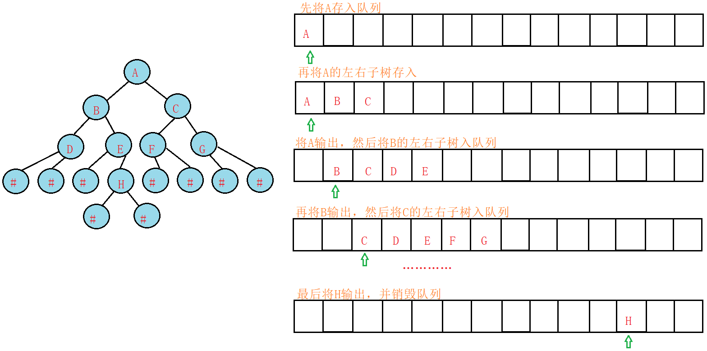
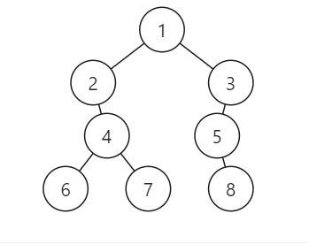

# 猪脚说第六期

本期主要的安排是补充一些二叉树的经典算法题，便于大家进行练习，选取的OJ还是力扣（和上次链表的oj一样）。

二叉树上的算法可以达到**特别难**的地步，所幸我们这门课的考试并没有过多要求算法设计能力，所以本期猪脚说里只会找一些相对基础/考试可能会考/适合用来练习的题目。

题目主要分为三部分：

1. 二叉树的基础的遍历，前中后序和层次遍历的基本方法**都要掌握**，是考试一定会考到的地方。至于前中后序的迭代遍历，学有余力的同学可以当做兴趣了解一下，不必完全掌握；
2. 二叉树上的一些基本操作，主要锻炼代码的流程控制能力；
3. BST上的经典操作。
4. 树的编程题

**需要特别强调的是**，由于二叉树这种结构天然就是递归的，所以其算法中会大量涉及到递归，希望大家看完本文后，对递归有更深刻的理解。

本系列猪脚说会随着大家理论课的进度来给出，本期主要给出二叉树遍历部分的讲解。

## 二叉树遍历

### 前中后序递归遍历

假设二叉树结点类型声明如下：

~~~c
typedef struct node{
	int val;  // 结点的值，类型可变
	struct node *left;
	struct node *right;
} node;
~~~

学完理论课后，相信大家都知道**一颗二叉树对象就可以由一个结点类型的指针表示**。

所以当根结点不为`NULL`时，我们的中序遍历可以写成这样：

~~~c
void inorderTraversal(node *root) {
	if (root == NULL) return;  // 递归的结束条件
	inorderTraversal(root->left);
	visit(root);// 访问结点，可以根据需求替换，比如printf("%d ", root->val);
	inorderTraversa(root->right);
}
~~~

这个算法不难理解，但是我更想在此强调一下设计递归函数的套路：

1. 首先要明确函数的返回值类型与参数列表，明确每一个参数和返回值的意义；
2. 确定终止条件；
3. 确定单层递归的逻辑。

以本代码为例：

显然遍历一层二叉树并不需要什么返回值，所以返回值类型设计成`void`了。同时，该函数的参数`node *root`**代表了现在我们要以中序遍历的顺序访问以该结点为根结点的二叉树**——这句话请认真理解，这对于理解二叉树上的递归设计非常重要。

终止条件一步是很多同学在设计递归函数时容易忽略的，本题当我们访问到不存在的结点时显然要终止递归。这里**强调**一句：一定要注意终止条件的判断，很多递归操作的bug都出在这里！

我们的单层递归逻辑应该是这样的：

1. 遍历以当前结点的左孩子为根结点的二叉树；
2. 访问（`visit`）该结点；
3. 遍历以当前结点的右孩子为根结点的二叉树。

要注意**遍历**和**访问**的区别！访问只是遍历过程中的一个步骤。

理解了本代码后，前序和后序的递归遍历就不再细讲了。

### 层次遍历

如果大家自己思考过层序遍历算法的设计，会发现就只有一个难点：对一个结点的遍历和访问没办法在同一层（同一次循环）中进行。

上面讲到的中序遍历递归法时，我们看到单步逻辑中，假设此时传入的参数是`root1`，那我在这个函数里就可以实现对`root1`的访问（`visit(root1)`），但是层序遍历中似乎无法做到这一点。

这也是该算法的难点所在：**对同一个结点的遍历和访问无法显式地在代码的同一处写出来**。

这时就要用到辅助的队列来解决问题了。我在网上找到了一张图：

大家在理解下面的讲解过程中，一定要记得我上面说的核心问题：对同一个结点的遍历和访问不是同时的！

从本图的示例中可以发现，在每一次循环中，我们先弹出了队首的元素——此时代表着我们访问该结点（比如图中访问的方式是输出该结点），然后把该元素的左孩子和右孩子（如果有的话）依次压入队列中——此时代表了对左右孩子的遍历。

可以发现，队列中的元素记录着的顺序就是我们遍历的顺序。每次访问时只会访问队首的一个元素，但是可能会入队0个或1个或2个元素——所以不难发现出循环的终止条件应当是队列为空。

可以写出伪代码如下：

~~~c
void layerorer(node *root) {
    if (root == NULL) return;  // 特判一下根结点是NULL的情况，实际做题时几乎不会遇到这种情况的
	初始化一个队列 q;
    q.push(root);  // 先将根结点入队
    while (队列不空) {
        node *cur = q.front();  // 取出队首的元素
        q.pop();  // 把队首的元素弹出去
        visit(cur);  // 访问这个结点
        
        // 将左右孩子入队（需要判断一下是否有左右孩子，不然会报访问0地址的错）
        if (cur->left) q.push(cur->left);
        if (cur->right) q.push(cur->right);
    }
}
~~~

这份代码已经足够清晰，只有队列的实现我这里没有给出，目的是想让大家自己练习一下C语言中关于队列的操作，**请大家自行完成这份代码的完整版本**（完成后可以发给助教来检查）

#### 扩展——如何在遍历的过程中获知结点层数

在上面的遍历中，我们只实现了按照层序遍历的顺序进行访问，但是某个结点具体属于哪一层我们并不清楚，现在请大家思考一下如何实现这一点？

具体来说，给你一颗二叉树，请按照层序遍历的顺序输出所有结点，结点间以空格分隔，层之间以换行符分隔。

比如对于下面的这棵树：

应当输出：

> 1
> 2 3
> 4 5
> 6 7 8

这道题相当于给大家的作业题，以下是给定的实验代码：

~~~c
#include <stdio.h>
#include <stdlib.h>
typedef struct node {
    int val;
    struct node *left;
    struct node *right;
} node;

void layerorder(node *root);

int main()
{
    node *root = (node *) malloc(sizeof(node));
    root->val = 1;
    root->left = (node *) malloc(sizeof(node));
    root->right = (node *) malloc(sizeof(node));
    root->left->val = 2;
    root->right->val = 3;
    root->left->left = NULL;
    root->left->right = (node *) malloc(sizeof(node));
    root->left->right->val = 4;
    root->left->right->left = (node *) malloc(sizeof(node));
    root->left->right->left->val = 6;
    root->left->right->right = (node *) malloc(sizeof(node));
    root->left->right->right->val = 7;
    root->left->right->right->left = NULL;
    root->left->right->right->right = NULL;
    root->left->right->left->left = NULL;
    root->left->right->left->right = NULL;
    root->right->right = NULL;
    root->right->left = (node *) malloc(sizeof(node));
    root->right->left->val = 5;
    root->right->left->left = NULL;
    root->right->left->right = (node *) malloc(sizeof(node));
    root->right->left->right->val = 8;
    root->right->left->right->left = NULL;
    root->right->left->right->right = NULL;

    layerorder(root);
    return 0;
}

void layerorder(node *root) {
    /*TODO 完成你的代码*/
}
~~~

请你完成`layerorder`函数的设计。

