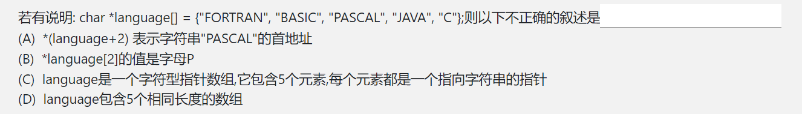
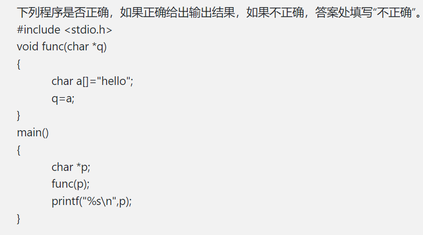

[TOC]

# 第一周上机问题汇总

## 文件后缀问题

本门课程使用C语言进行实验，大家在创建文件时（无论用什么IDE）一定要创建后缀为`.c`的文件！否则的话，文件是无法提交到平台评测的，同时在本地调试时也会遇到意想不到的bug。

比如有一位同学创建了`.cpp`文件，其中写了一个名为`try`的函数，结果报错——在C语言中是没有`try`这个关键字的，只有C++才有。

## 不可见字符问题

有同学看着自己的输出和答案一模一样，但还是WA——可能是输出了不可见字符的问题。以后大家遇到该问题可以往这方面去想想，至于判断与解决方法，希望大家在看完本文最后的“程序调试”小结后自己思考一下。

## 指针数组与运算符优先级

在C语言中，**任何**类型的数据都可以创建数组，指针类型也不例外，我们不用被名字迷惑住——其本质就是一个数组，数组中的每一个元素都是指针。

比如本次作业的这道题：

其等价的声明是这样的：

~~~c
char *p0 = "FORTRAN";
char *p1 = "BASIC";
char *p2 = "PASCAL";
char *p3 = "JAVA";
char *p4 = "C";
char *language[] = {p0, p1, p2, p3, p4};
~~~

对于A选项，这种写法大家在程设课上应该见过，就等价于`language[2]`，也即`p2`，就是字符串“PASCAL”的首地址。

对于B选项，`数组[i]`的优先级要比解引用高，所以等价于`*(language[2])`，而`language[2]`表示数组的第二个元素，即`p2`，再对其解引用就是字母P;

对于C选项，根据前文所述，显然是正确的；

对于D选项，`language`包含的是5个指针，而这5个指针分别指向一个数组的首地址。

## 变量的存储期

本次作业的这道题：

显然是不对的，但大家可能一下反应不过来，但是如下代码：

~~~c
void fun() {
	int a = 1;
}

int main()
{
	fun();
	printf("%d", a);
}
~~~

大家一下就能看明白：变量`a`声明在`fun`函数中，在函数调用结束后就不存在了，所以主函数中会报错。

其实，在函数中所开辟的所有存储空间，在函数调用结束后都会被自动回收，本题中的字符串显然也会被回收，所以在函数调用后，变量`p`所指向的那块区域的内容并不确定，即`p`是野指针，对其进行打印显然不对。

关于这部分内容的原理，此处暂不做讲解。大家有兴趣的话，可以自行到网上搜索“C语言的堆区和栈区”来了解。

如果大家真的想在函数中开辟一块存储空间，并且不会自动被回收的话，需要使用上学期程设最后讲解的`malloc`函数来申请存储空间（也就是把变量开辟到堆区），建议对该函数用法不熟悉的同学尽快复习一下，这在本课程中非常重要。

## switch语句以及程序调试方法

有同学给我看了如下代码：

~~~c
#include <stdio.h>

int fun(int x) {
    switch (x)
    {
        case 1: return 1;
        case 2:
        case 3: return 7777;       
    }
}
int main()
{
    printf("%d", fun(2));
    return 0;
}
~~~

他惊奇地发现：程序运行输出了`7777`。

单从语法上看，大家上学期应该也学过，每一个`case`最后都要加上`break;`，这也是问题出现的原因。

至于具体原理：大家可以把`case`理解成“一道闸门”，当它没有匹配到正确的值时，会跳转到下一个`case`进行匹配。但是一旦匹配到了，就会一直向下执行，这种行为被称为“fall-through”——这也是为什么通常情况下我们会在每一个分支最后都加一个`breakl`

其实，就算不知道原理，大家也可以通过下面的代码大概猜出来其中的道理：

~~~c
#include <stdio.h>

int fun(int x) {
    switch (x)
    {
        case 1: {
            printf("Enter case 1\n" );
            return 1;
        }
        printf("Leave case 1\n" );

        case 2: {
            printf("Enter case 2\n" );
        }
        printf("Leave case 2\n" );

        case 3: {
            printf("Enter case 3\n" );
            return 7777;           
        }
        printf("Leave case 3\n" );       
    }
}
int main()
{
    fun(2);
    return 0;
}
~~~

输出：

> Enter case 2
> Leave case 2
> Enter case 3

`case 1`没有进入也没有出去，`case 3`的Leave输出被return截断了，而`case 2`既进入又离开，相当于这个阀门被“打开”了。

### 程序调试

上面这个具体的知识并没有那么重要，重要的是想告诉大家如下自己调试程序。在本门课程中，调试能力甚至比写代码的能力更重要，因为大家只要认真地完成课程要求，到最后几乎不会有代码算法实现上的困难。但数据结构的编程题是应用题，一道题往往分为很多步骤，准确地定位错点并发现问题的调试能力非常重要。

我调试程序最大的经验就是**对每个任务分块测试，打印出结果量来定位，打印出过程量来寻找具体错因**。

比如我现在有一个任务：读入若干整数，并对其排序，然后再进行别的操作。显然可以写出下面的伪代码：

~~~c
int main()
{
	int array[105] = {0};  // 用于存储整数
	int tmp;  // 临时变量
	int num = 0;  // 读入数据个数
	while (scanf("%d", &tmp) != EOF) array[num++] = tmp;  // 读入数据
	
    // for (int i = 0; i < num; i++) {
    //     printf("%d ", array[i]);
    // }
	/*
	
	对array数组进行排序
	
	*/ 
	
	// for (int i = 0; i < num; i++) {
    //     printf("%d ", array[i]);
    // }
	
    // do something else
	

	return 0;
}
~~~

两段注释的内容是打印整个数组，第一次打印就可以帮我们判断读入数据的环节是否出了问题，第二次打印就可以帮我们确定排序是否出了问题。

我的习惯是在写代码时就会写上注释中的这两次输出——确保程序写到当前这步时是没有任何问题的。当然，大家在debug不知从何下手时，也可以从上到下把每一个业务逻辑后都加上结果输出语句，很快就能定位到错点。

至于具体的错误，也可以通过输出过程量来确定：比如说我的程序在循环中出不来了，那我就可以在每次循环开始时输出当次循环次数，这样就能确定是第一次循环就卡住了，还是中间某次处理时卡住，还是卡死循环（无限输出）了。

当然，具体的情况会有具体的调试方法，在后面我也会更多地和大家分享调试的经验。但无论如何，希望大家能把这个调试的理念记在心里——在你不知从何下手时会有很大帮助。